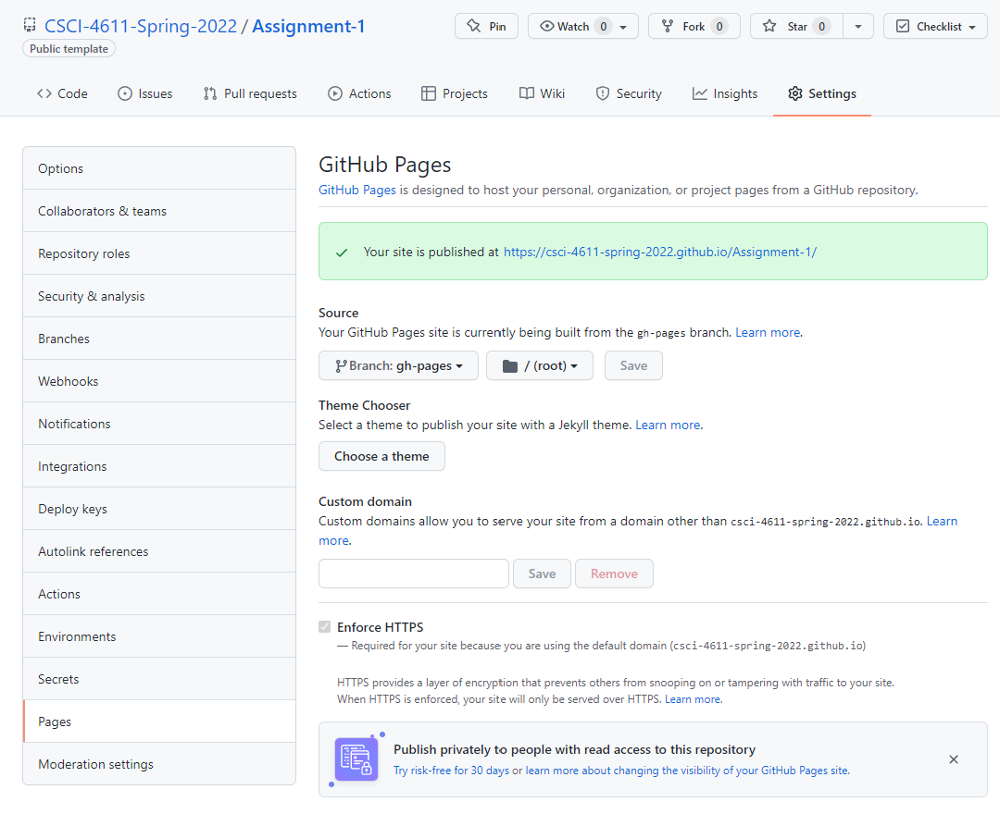

# Assignment 1: Space Minesweeper

**Due: Tuesday, September 27, 11:59pm CDT**

This assignment involves creating a simple, fun game using 2D graphics. You will learn to:

- Use TypeScript and GopherGfx for some serious programming
- Work with 2D graphics coordinate systems and vectors
- Implement game update loops and event handlers
- Animate computer graphics based on user input

In general, assignments in this class are intended to be implemented in a step-by-step manner.  The rubric below lists all of the features you should implement, starting with the basic functionality and then working up to more advanced features.

You can try a [finished version of the game](https://csci-4611-fall-2022.github.io/Builds/Assignment-1/) in the Builds repository on the course GitHub. This is only a representative example, and you do not need to make your game look or play exactly the same. Your program can have a different look and feel, so long as it satisfies the requirements specified in the rubric.

## Submission Information

You should fill out this information before submitting your assignment. Make sure to document the name and source of any third party assets that you added, such as models, images, sounds, or any other content used that was not solely written by you. 

Name:

Third Party Assets:

Wizard Bonus Functionality:

## Prerequisites

To work with this code, you will first need to install [Node.js 16.17.0 LTS](https://nodejs.org/) and [Visual Studio Code](https://code.visualstudio.com/). 

I also recommend you install the following useful VS Code extensions:

- [GitLens](https://marketplace.visualstudio.com/items?itemName=eamodio.gitlens) (makes source control easier)
- [ESLint](https://marketplace.visualstudio.com/items?itemName=dbaeumer.vscode-eslint) (static code analysis tool that can flag errors)
- [JavaScript Debugger](https://marketplace.visualstudio.com/items?itemName=ms-vscode.js-debug-nightly) (essential for real-time debugging)
- [WebGL GLSL Editor](https://marketplace.visualstudio.com/items?itemName=raczzalan.webgl-glsl-editor) (used for programming shaders later in the course)

## Getting Started

The starter code implements the general structure that we reviewed in lecture.  After cloning your repository, you will need to set up the initial project by pulling the dependencies from the node package manager with:

```
npm install
```

This will create a `node_modules` folder in your directory and download all the dependencies needed to run the project.  Note that this folder is listed in the `.gitignore` file and should not be committed to your repository.  After that, you can compile and run a server with:

```
npm run start
```

Webpack should launch your program in a web browser automatically.  If not, you can run it by pointing your browser at `http://localhost:8080`.

## Rubric

Graded out of 20 points.

This assignment is divided into six parts.  The provided starter code implements the complete structure of the game and has extensive comments throughout.  The locations to add your code for each of the requirements listed below is marked with `ADD YOUR CODE HERE`.  Note that you do **not** need to make any changes to the existing code, nor do you need to add any code outside of the areas marked in the comments.  However, you should feel free to change the existing code if you want to do something fun or go beyond the requirements of the assignment.

#### Part 1: Star Movement

- The starter code includes a ship that rotate to point towards the mouse cursor.  In class, we made the ship move towards the position of the mouse.  However, this time we want the ship to always be at the center of the screen.  Therefore, instead of moving the ship, you should move the stars in the opposite direction, thereby creating the *illusion* of ship movement. (2)
- To create a cool effect, we can make the velocity of each star dependent on its size, so that smaller stars appear to move slower than bigger stars.  This creates a depth illusion is known as [parallax](https://en.wikipedia.org/wiki/Parallax).  You can achieve this by considering the scale of each star when computing its velocity.  Note that you can use either `.scale.x` or `.scale.y` for this because the star is uniformly scaled. (2)

#### Part 2: Mine Movement

- By default, the mines are programmed to slowly move towards the ship.  In order to complete the illusion of the ship flying through through the scene, you will also need to additionally move each mine in the opposite of the ship's direction, similar to the way you moved the stars. (1)
- Next, add some slow rotation to each mine so they appear to spin. (2)

#### Part 3: Laser Spawning

- When the user clicks the mouse, a new instance of the laser object should be added to the scene. (2)
- When the laser is created, it should be rotated to point towards the mouse cursor, similar to the way the ship was pointed in that direction. (1)

#### Part 4: Laser Movement

- In the update method, each laser instance should be translated forward so that it appears to be shooting out from the ship. (2)
- When a laser moves outside the boundary of the window, it should be removed from the scene.  We don't want an infinite number of lasers that can slow down our game! (2)

#### Part 5: Mine Collisions

- Complete the code in the `checkForMineCollisions()` method to test for mine-to-mine collisions. (2)  
- When two mines intersect, it should cause them both to explode. (1)

#### Part 6: Laser Collisions

- Complete the code in the `checkForLaserCollisions()` method to test for laser-to-mine collisions (2). 
- When an intersection occurs, the mine should explode and the laser should be removed from the scene. (1)

## Wizard Bonus Challenge

All of the assignments in the course will include great opportunities for students to go beyond the requirements of the assignment and do cool extra work. On each assignment, you can earn **one bonus point** for implementing a meaningful new feature to your program. This should involve some original new programming, and should not just be something that can be quickly implemented by copying and slightly modifying existing code.  

For example, in this assignment, you could potentially implement the logic to turn this into a fully functional game.  This could involve making the mines capable of destroying the player's ship or providing an objective to "win" the game.  Alternatively, you could program a new type of enemy or weapon, possibly by importing new assets.  [Kenney](https://www.kenney.nl/assets) is a great source for free assets to use in game development. Or, even better, think of your own cool, creative idea!

A single point may not sound like a lot, but keep in mind that on a 20-point scale, this is equivalent to a 5% bonus! Make sure to document your wizard functionality in the Submission Information portion of this readme file, so that the TAs know what to look for when they grade your program.

The wizard bonus challenge also offers you a chance to show off your skills and creativity!  While grading the assignments the TAs will identify the best four or five examples of people doing cool stuff with computer graphics. We call these students our **wizards**, and after each assignment, the students selected as wizards will have their programs demonstrated to the class.

## Submission

When you commit and push your assignment to GitHub, an automated script will build and deploy the production code to the `gh-pages` branch of your repository.  However, your submission is **not complete** until you do the following:

1. Open your repository on GitHub and go to Settings->Pages.
2. Change the source to the `gh-pages` branch, then save.



You will need to wait a few minutes for the website to deploy.  After that, make sure to test everything by pointing your web browser at the link generated for your build:

```
https://csci-4611-fall-2022.github.io/your-repo-name-here
```

If your program runs correctly, then you are finished!  The published build will indicate to the TAs that your assignment is ready for grading.  If you change your mind and want to make further changes to your code, then just set the GitHub pages source back to `None` and it will unpublish the website.

Note that the published JavaScript bundle code generated by the TypeScript compiler has been obfuscated so that it is not human-readable. So, you can feel free to send this link to other students, friends, and family to show off your work!

## Acknowledgments

The ship graphics were from the Kenney [Space Shooter Redux](https://www.kenney.nl/assets/space-shooter-redux) and [Simple Space](https://www.kenney.nl/assets/simple-space) asset packages.

## License

Material for [CSCI 4611 Fall 2022](https://csci-4611-fall-2022.github.io) by [Evan Suma Rosenberg](https://illusioneering.umn.edu/) is licensed under a [Creative Commons Attribution-NonCommercial-ShareAlike 4.0 International License](http://creativecommons.org/licenses/by-nc-sa/4.0/).
